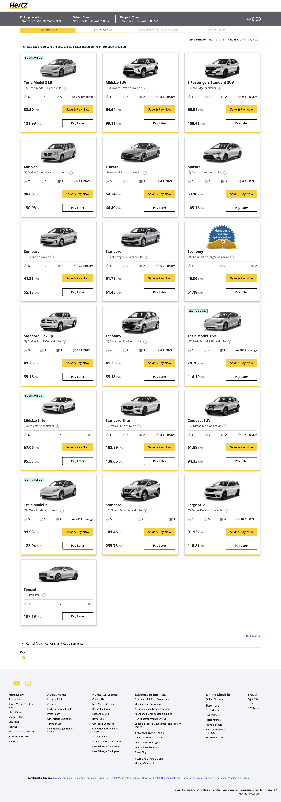

# Car Rental Web Scraping App 🚗

A Java-based GUI application that scrapes car rental data, validates inputs with a spell checker, and presents a clean, user-friendly interface for searching available cars.

## 📌 Features
- 🔍 **Web Scraping**: Collects car rental data from specified sources.
- 📅 **Date & Time Picker**: Choose rental period intuitively.
- ✨ **Spell Checker**: Smart auto-correction for city/location inputs.
- 📊 **CSV Data Handling**: Loads data from `Cardata1.csv`.
- 📷 **Screenshots**: Includes UI views for homepage and car listings.

## 🧰 Technologies Used
- Java (Swing for GUI)
- Maven for project management
- Jsoup (assumed for scraping)
- Custom-built spell checker

## 🖥️ Screenshots

### Homepage


### Car List


## 🏁 Getting Started

### Prerequisites
- Java 11+
- Maven installed

### Run the Application

```bash
# Compile the project
mvn clean install

# Run the application
mvn exec:java -Dexec.mainClass="com.webscraping.CarRental.App"
